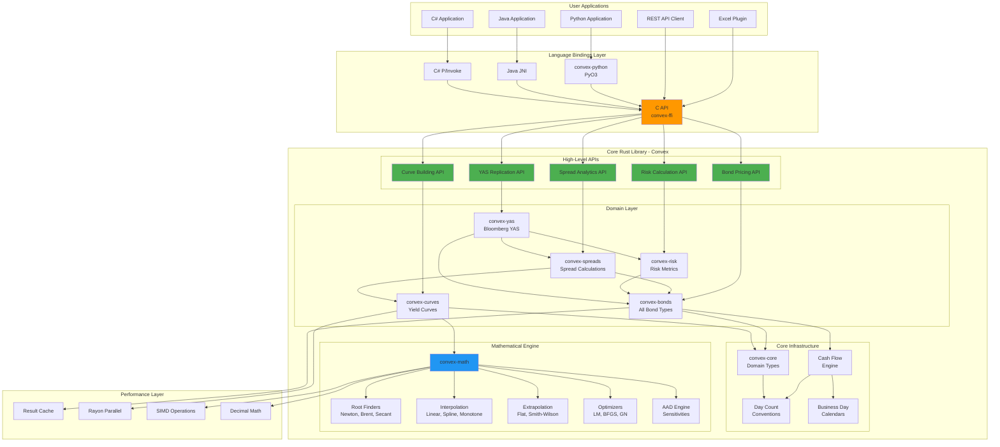

# Convex Architecture

## System Architecture Overview



---

## Crate Structure

### convex-core (Foundation)

Core types and infrastructure with no external dependencies except `rust_decimal`, `chrono`, `thiserror`.

```
convex-core/src/
├── lib.rs                    # Public API, prelude
├── types/
│   ├── mod.rs                # Re-exports
│   ├── price.rs              # CleanPrice, DirtyPrice
│   ├── yield_type.rs         # Yield newtype
│   ├── spread.rs             # Spread (bps)
│   ├── rate.rs               # Rate (coupon, discount, forward)
│   ├── risk.rs               # Duration, Convexity, DV01
│   ├── currency.rs           # Currency, Money<C>, FxRate
│   └── notional.rs           # Notional, Factor
├── date/
│   ├── mod.rs
│   ├── date.rs               # Date wrapper
│   ├── tenor.rs              # Tenor enum (O/N, 1W, 1M, 1Y, etc.)
│   ├── period.rs             # Period arithmetic
│   ├── frequency.rs          # Annual, Semi, Quarterly, Monthly
│   └── schedule.rs           # Date schedule generation
├── daycounts/
│   ├── mod.rs
│   ├── traits.rs             # DayCount trait
│   ├── actual.rs             # ACT/360, ACT/365F, ACT/365L
│   ├── actual_actual.rs      # ACT/ACT ICMA, ISDA, AFB
│   ├── thirty.rs             # 30/360 US, 30E/360, 30/360 German
│   └── bus252.rs             # Business/252 (Brazil)
├── calendar/
│   ├── mod.rs
│   ├── traits.rs             # Calendar trait
│   ├── holiday.rs            # HolidayRule enum
│   ├── calendar.rs           # HolidayCalendar (bitmap)
│   ├── roll.rs               # DateRoll conventions
│   └── regions/
│       ├── mod.rs
│       ├── us.rs             # NYSE, SIFMA, FederalReserve
│       ├── uk.rs             # UK Bank Holidays
│       ├── eu.rs             # TARGET2
│       ├── jp.rs             # Japan
│       └── combined.rs       # Calendar union/intersection
└── errors.rs                 # Core error types
```

### convex-math (Mathematical Engine)

All numerical methods and mathematical infrastructure.

```
convex-math/src/
├── lib.rs
├── solvers/
│   ├── mod.rs
│   ├── traits.rs             # Solver trait
│   ├── newton.rs             # Newton-Raphson
│   ├── brent.rs              # Brent's method
│   ├── secant.rs             # Secant method
│   ├── bisection.rs          # Bisection (fallback)
│   └── hybrid.rs             # Hybrid solver
├── interpolation/
│   ├── mod.rs
│   ├── traits.rs             # Interpolator trait
│   ├── linear.rs             # Linear interpolation
│   ├── log_linear.rs         # Log-linear
│   ├── cubic_spline.rs       # Natural cubic spline
│   ├── monotone_convex.rs    # Hagan monotone convex
│   ├── bessel.rs             # Bessel/Hermite
│   ├── tension_spline.rs     # Tension spline
│   └── akima.rs              # Akima spline
├── extrapolation/
│   ├── mod.rs
│   ├── traits.rs             # Extrapolator trait
│   ├── flat.rs               # Flat extrapolation
│   ├── linear.rs             # Linear extrapolation
│   └── smith_wilson.rs       # Smith-Wilson (regulatory)
├── parametric/
│   ├── mod.rs
│   ├── nelson_siegel.rs      # Nelson-Siegel model
│   ├── svensson.rs           # Svensson extension
│   └── bjork_christensen.rs  # Alternative parameterization
├── optimization/
│   ├── mod.rs
│   ├── levenberg_marquardt.rs
│   ├── gauss_newton.rs
│   ├── bfgs.rs
│   └── differential_evolution.rs
├── aad/
│   ├── mod.rs
│   ├── tape.rs               # Computation tape
│   ├── dual.rs               # Dual numbers
│   └── adjoints.rs           # Adjoint computation
├── linear_algebra/
│   ├── mod.rs
│   ├── tridiagonal.rs        # Tridiagonal solver (for splines)
│   ├── lu.rs                 # LU decomposition
│   └── cholesky.rs           # Cholesky decomposition
└── statistics/
    ├── mod.rs
    └── distributions.rs      # Normal, etc.
```

### convex-curves (Yield Curve Construction)

Comprehensive curve building with all interpolation methods.

```
convex-curves/src/
├── lib.rs
├── traits.rs                 # Curve traits
├── curve/
│   ├── mod.rs
│   ├── discount_curve.rs     # Discount factor curve
│   ├── zero_curve.rs         # Zero rate curve
│   ├── forward_curve.rs      # Forward rate curve
│   ├── par_curve.rs          # Par swap rate curve
│   └── spread_curve.rs       # Credit/basis spread curve
├── bootstrap/
│   ├── mod.rs
│   ├── bootstrapper.rs       # Main bootstrap engine
│   ├── sequential.rs         # Sequential bootstrap
│   ├── global.rs             # Global fitting
│   └── hybrid.rs             # Hybrid approach
├── instruments/
│   ├── mod.rs
│   ├── traits.rs             # CurveInstrument trait
│   ├── deposit.rs            # Cash deposits
│   ├── fra.rs                # Forward rate agreements
│   ├── future.rs             # Interest rate futures
│   ├── swap.rs               # Interest rate swaps
│   ├── ois_swap.rs           # OIS swaps
│   ├── basis_swap.rs         # Basis swaps
│   ├── xccy_swap.rs          # Cross-currency swaps
│   └── bond.rs               # Bonds as curve instruments
├── multi_curve/
│   ├── mod.rs
│   ├── environment.rs        # MultiCurveEnvironment
│   ├── dual_curve.rs         # OIS discounting + projection
│   └── basis.rs              # Basis curve handling
├── inflation/
│   ├── mod.rs
│   ├── cpi_curve.rs          # CPI projection curve
│   ├── real_curve.rs         # Real rate curve
│   └── breakeven.rs          # Breakeven inflation
├── fitting/
│   ├── mod.rs
│   ├── nelson_siegel.rs      # NS fitting
│   ├── svensson.rs           # Svensson fitting
│   └── spline_fitting.rs     # Smoothing spline
├── validation/
│   ├── mod.rs
│   ├── reprice.rs            # Reprice input instruments
│   ├── arbitrage.rs          # Arbitrage checks
│   └── smoothness.rs         # Smoothness metrics
└── streaming/
    ├── mod.rs
    ├── live_curve.rs         # Real-time curve updates
    └── bump.rs               # Curve bumping/shifting
```

### convex-bonds (Bond Instruments & Pricing)

All bond types with complete pricing support.

```
convex-bonds/src/
├── lib.rs
├── traits.rs                 # Bond trait
├── instruments/
│   ├── mod.rs
│   │
│   │── government/
│   │   ├── mod.rs
│   │   ├── treasury_note.rs  # US T-Notes, T-Bonds
│   │   ├── treasury_bill.rs  # T-Bills (discount)
│   │   ├── tips.rs           # Treasury Inflation-Protected
│   │   ├── frn.rs            # Treasury FRN
│   │   ├── gilt.rs           # UK Gilts
│   │   ├── gilt_linker.rs    # UK Index-Linked Gilts
│   │   ├── bund.rs           # German Bunds
│   │   └── jgb.rs            # Japanese Government Bonds
│   │
│   ├── corporate/
│   │   ├── mod.rs
│   │   ├── fixed.rs          # Fixed rate corporate
│   │   ├── callable.rs       # Callable bonds
│   │   ├── putable.rs        # Putable bonds
│   │   ├── sinking_fund.rs   # Sinking fund bonds
│   │   ├── convertible.rs    # Convertible bonds
│   │   ├── exchangeable.rs   # Exchangeable bonds
│   │   ├── perpetual.rs      # Perpetual/AT1/AT2
│   │   └── step_up.rs        # Step-up coupon
│   │
│   ├── municipal/
│   │   ├── mod.rs
│   │   ├── go_bond.rs        # General obligation
│   │   ├── revenue.rs        # Revenue bonds
│   │   └── prerefunded.rs    # Pre-refunded bonds
│   │
│   ├── agency/
│   │   ├── mod.rs
│   │   ├── debenture.rs      # Agency debentures
│   │   └── callable_agency.rs
│   │
│   ├── mbs/
│   │   ├── mod.rs
│   │   ├── pass_through.rs   # MBS pass-through
│   │   ├── prepayment.rs     # Prepayment models (CPR, PSA)
│   │   └── tba.rs            # To-be-announced
│   │
│   ├── floating/
│   │   ├── mod.rs
│   │   ├── frn.rs            # Floating rate notes
│   │   ├── capped_frn.rs     # With cap
│   │   ├── floored_frn.rs    # With floor
│   │   └── collared_frn.rs   # With collar
│   │
│   └── zero_coupon.rs        # Zero coupon bonds
│
├── cashflows/
│   ├── mod.rs
│   ├── cashflow.rs           # CashFlow struct
│   ├── schedule.rs           # Schedule generation
│   ├── generator.rs          # Cash flow generator
│   └── prepayment.rs         # MBS prepayment projection
│
├── pricing/
│   ├── mod.rs
│   ├── yield_solver.rs       # Newton-Raphson YTM
│   ├── price_from_yield.rs   # Closed-form pricing
│   ├── accrued.rs            # Accrued interest
│   ├── tbill.rs              # T-Bill discount/BEY
│   ├── tips_pricing.rs       # TIPS real yield, index ratio
│   ├── muni_pricing.rs       # Tax-equivalent yield
│   ├── mbs_pricing.rs        # MBS with prepayment
│   ├── frn_pricing.rs        # FRN discount margin
│   └── convertible_pricing.rs # Convertible analytics
│
├── options/
│   ├── mod.rs
│   ├── call_schedule.rs      # Call schedule modeling
│   ├── put_schedule.rs       # Put schedule modeling
│   ├── binomial_tree.rs      # Binomial pricing tree
│   ├── trinomial_tree.rs     # Trinomial tree
│   ├── hull_white.rs         # Hull-White model
│   ├── bdt.rs                # Black-Derman-Toy
│   ├── oas.rs                # OAS calculation
│   └── ytw.rs                # Yield to worst
│
├── convertibles/
│   ├── mod.rs
│   ├── analytics.rs          # Parity, premium, bond floor
│   ├── pricer.rs             # Binomial convertible pricer
│   └── greeks.rs             # Delta, gamma, vega
│
└── conventions/
    ├── mod.rs
    ├── us_treasury.rs        # US Treasury conventions
    ├── us_corporate.rs       # US Corporate conventions
    ├── us_municipal.rs       # US Municipal conventions
    ├── uk_gilt.rs            # UK Gilt conventions
    ├── german_bund.rs        # German Bund conventions
    └── eurobond.rs           # Eurobond conventions
```

### convex-spreads (Spread Analytics)

```
convex-spreads/src/
├── lib.rs
├── g_spread.rs               # Government spread
├── i_spread.rs               # Interpolated swap spread
├── z_spread.rs               # Zero-volatility spread
├── asw/
│   ├── mod.rs
│   ├── par_par.rs            # Par-par asset swap
│   └── proceeds.rs           # Proceeds asset swap
├── oas.rs                    # Option-adjusted spread
├── cds_basis.rs              # CDS basis
└── discount_margin.rs        # FRN discount margin
```

### convex-risk (Risk Analytics)

```
convex-risk/src/
├── lib.rs
├── duration/
│   ├── mod.rs
│   ├── macaulay.rs           # Macaulay duration
│   ├── modified.rs           # Modified duration
│   ├── effective.rs          # Effective duration
│   ├── key_rate.rs           # Key rate duration
│   ├── spread_duration.rs    # Spread duration
│   └── partial.rs            # Partial DV01s
├── convexity/
│   ├── mod.rs
│   ├── analytical.rs
│   └── effective.rs
├── dv01.rs                   # DV01 / PV01 / PVBP
├── var/
│   ├── mod.rs
│   ├── historical.rs
│   └── parametric.rs
└── hedging/
    ├── mod.rs
    ├── hedge_ratio.rs
    └── portfolio.rs
```

### convex-yas (Bloomberg YAS Replication)

```
convex-yas/src/
├── lib.rs
├── yas.rs                    # Main YAS calculation
├── yields/
│   ├── mod.rs
│   ├── street.rs             # Street convention
│   ├── true_yield.rs         # True yield
│   ├── current.rs            # Current yield
│   ├── simple.rs             # Simple yield
│   └── money_market.rs       # MM yields (discount, BEY)
├── invoice/
│   ├── mod.rs
│   └── settlement.rs         # Settlement invoice
└── formatting.rs             # YAS screen formatting
```

### convex-ffi (Foreign Function Interface)

```
convex-ffi/src/
├── lib.rs
├── c_api/
│   ├── mod.rs
│   ├── types.rs              # C-compatible types
│   ├── bond.rs               # Bond functions
│   ├── curve.rs              # Curve functions
│   ├── pricing.rs            # Pricing functions
│   └── error.rs              # Error handling
└── bindings/
    ├── python.rs             # PyO3 helpers
    ├── java.rs               # JNI helpers
    └── csharp.rs             # P/Invoke helpers
```

---

## Key Design Patterns

### 1. Newtype Pattern for Type Safety

```rust
#[derive(Debug, Clone, Copy, PartialEq, PartialOrd)]
#[repr(transparent)]
pub struct Yield(Decimal);

impl Yield {
    pub fn from_percent(pct: f64) -> Self { /* ... */ }
    pub fn from_decimal(dec: Decimal) -> Self { /* ... */ }
    pub fn as_decimal(&self) -> Decimal { self.0 }
    pub fn as_percent(&self) -> f64 { /* ... */ }
}
```

### 2. Builder Pattern for Complex Types

```rust
pub struct FixedRateBond { /* private fields */ }

impl FixedRateBond {
    pub fn builder() -> FixedRateBondBuilder {
        FixedRateBondBuilder::default()
    }
}

pub struct FixedRateBondBuilder {
    cusip: Option<String>,
    coupon_rate: Option<Rate>,
    maturity: Option<Date>,
    // ...
}

impl FixedRateBondBuilder {
    pub fn cusip(mut self, cusip: impl Into<String>) -> Self { /* ... */ }
    pub fn coupon_rate(mut self, rate: Rate) -> Self { /* ... */ }
    pub fn build(self) -> Result<FixedRateBond, BuildError> { /* ... */ }
}
```

### 3. Trait-Based Polymorphism

```rust
pub trait Bond: Send + Sync {
    fn cash_flows(&self, settlement: Date) -> Vec<CashFlow>;
    fn accrued_interest(&self, settlement: Date) -> Decimal;
    fn maturity(&self) -> Date;
    fn day_count(&self) -> &dyn DayCount;
    fn frequency(&self) -> Frequency;
    // ...
}

pub trait Curve: Send + Sync {
    fn discount_factor(&self, t: f64) -> f64;
    fn zero_rate(&self, t: f64) -> f64;
    fn forward_rate(&self, t1: f64, t2: f64) -> f64;
}

pub trait Interpolator: Send + Sync {
    fn interpolate(&self, x: f64) -> f64;
    fn derivative(&self, x: f64) -> f64;
}
```

### 4. Error Handling with Context

```rust
#[derive(Debug, thiserror::Error)]
pub enum CurveError {
    #[error("bootstrap failed for {instrument} at tenor {tenor}: {reason}")]
    BootstrapFailure {
        instrument: String,
        tenor: String,
        reason: String,
    },
    
    #[error("interpolation out of range: {value} not in [{min}, {max}]")]
    OutOfRange { value: f64, min: f64, max: f64 },
    
    #[error("negative forward rate at {tenor}: {rate}")]
    NegativeForward { tenor: f64, rate: f64 },
    
    #[error("solver did not converge: {0}")]
    SolverError(#[from] SolverError),
}
```

---

## Data Flow

### Curve Building Flow

```
Input Instruments
       │
       ▼
┌─────────────────┐
│  Sort by tenor  │
└────────┬────────┘
         │
         ▼
┌─────────────────────────────────────────┐
│  For each instrument:                   │
│  1. Get discount factors for known pts  │
│  2. Solve for new discount factor       │
│  3. Apply interpolation                 │
│  4. Validate (reprice, positive fwd)    │
└────────────────────┬────────────────────┘
                     │
                     ▼
┌─────────────────────────────────────────┐
│  Post-processing:                       │
│  1. Validate full curve                 │
│  2. Cache interpolation coefficients    │
│  3. Build forward curve                 │
└────────────────────┬────────────────────┘
                     │
                     ▼
            Calibrated Curve
```

### Bond Pricing Flow

```
Bond + Curve + Settlement
         │
         ▼
┌─────────────────────────────────┐
│  Generate cash flows            │
│  (considering optionality)      │
└────────────────┬────────────────┘
                 │
                 ▼
┌─────────────────────────────────┐
│  For each cash flow:            │
│  1. Calculate time to CF        │
│  2. Get discount factor         │
│  3. Discount cash flow          │
└────────────────┬────────────────┘
                 │
                 ▼
┌─────────────────────────────────┐
│  Sum PVs → Dirty Price          │
│  Calculate accrued interest     │
│  Clean Price = Dirty - Accrued  │
└────────────────┬────────────────┘
                 │
                 ▼
         PriceResult
```

---

## Testing Architecture

```
tests/
├── bloomberg_validation/
│   ├── mod.rs
│   ├── yield_tests.rs        # YTM validation
│   ├── spread_tests.rs       # G/Z/ASW validation
│   ├── risk_tests.rs         # Duration/convexity
│   ├── treasury_tests.rs     # US Treasury
│   ├── corporate_tests.rs    # Corporate bonds
│   ├── muni_tests.rs         # Municipal bonds
│   ├── tips_tests.rs         # TIPS
│   └── mbs_tests.rs          # MBS
│
├── curve_validation/
│   ├── mod.rs
│   ├── bootstrap_tests.rs    # Bootstrap accuracy
│   ├── interpolation_tests.rs # All interpolation methods
│   ├── extrapolation_tests.rs # Extrapolation methods
│   ├── multi_curve_tests.rs  # Multi-curve framework
│   └── reprice_tests.rs      # Instrument repricing
│
├── scenarios/
│   ├── mod.rs
│   ├── portfolio_tests.rs
│   └── stress_tests.rs
│
└── property_tests/
    ├── mod.rs
    └── invariants.rs         # Property-based tests

benches/
├── pricing_bench.rs
├── curve_bench.rs
├── interpolation_bench.rs
├── risk_bench.rs
└── portfolio_bench.rs
```

---

## Performance Optimization

### Hot Path Optimization

```rust
// Use #[inline] on small, frequently-called functions
#[inline]
pub fn discount_factor(rate: f64, time: f64) -> f64 {
    (-rate * time).exp()
}

// Use #[inline(always)] only when benchmarks prove benefit
#[inline(always)]
fn interpolate_linear(x: f64, x0: f64, y0: f64, x1: f64, y1: f64) -> f64 {
    y0 + (x - x0) * (y1 - y0) / (x1 - x0)
}
```

### Cache Strategy

```rust
pub struct CachedCurve {
    /// Raw curve points
    pillars: Vec<(f64, f64)>,
    
    /// Precomputed spline coefficients
    spline_coeffs: Vec<SplineCoefficients>,
    
    /// Cached discount factors at common tenors
    df_cache: HashMap<OrderedFloat<f64>, f64>,
}
```

### Parallel Processing

```rust
use rayon::prelude::*;

// Portfolio pricing
let prices: Vec<PriceResult> = bonds
    .par_iter()
    .map(|bond| price_bond(bond, &curve, settlement))
    .collect();

// Curve building with parallel instrument pricing
let pv_errors: Vec<f64> = instruments
    .par_iter()
    .map(|inst| inst.price(&curve) - inst.market_price())
    .collect();
```
