# Convex Architecture

## System Architecture Overview

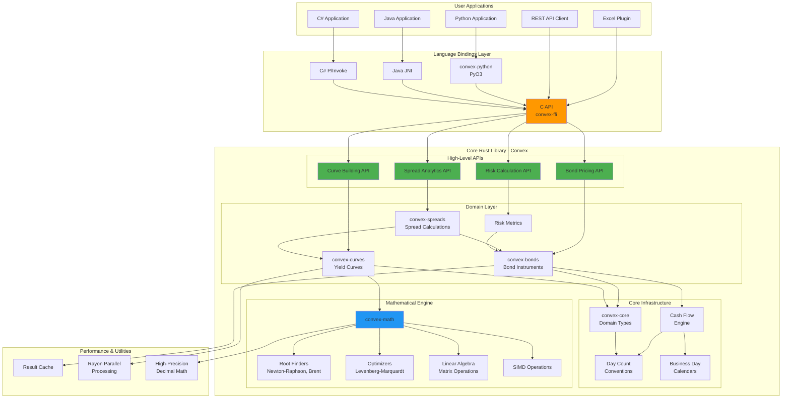

## Component Architecture

### 1. Core Type System (convex-core)

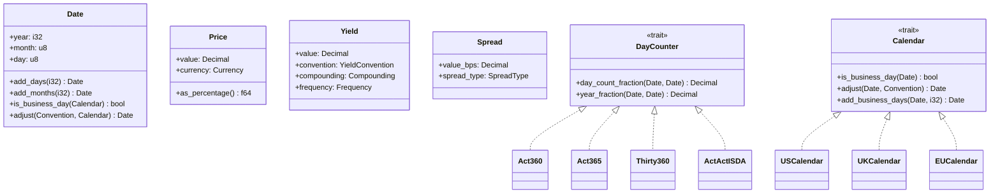

### 2. Bond Pricing Engine

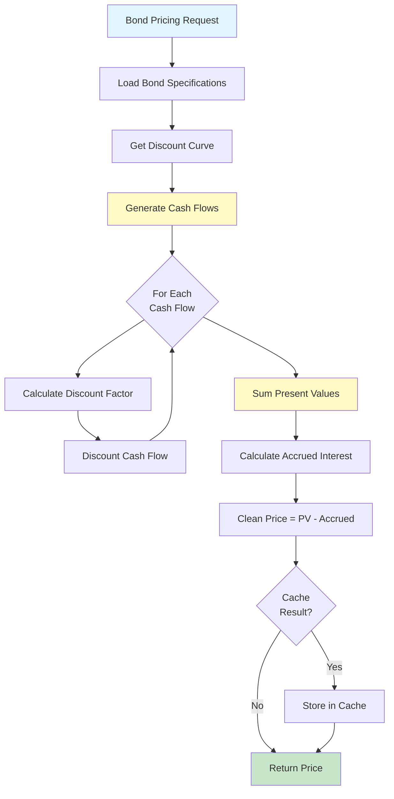

### 3. Yield Curve Construction Flow

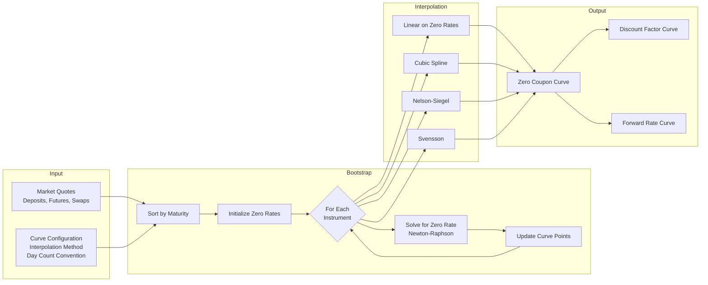

### 4. Spread Calculation Architecture

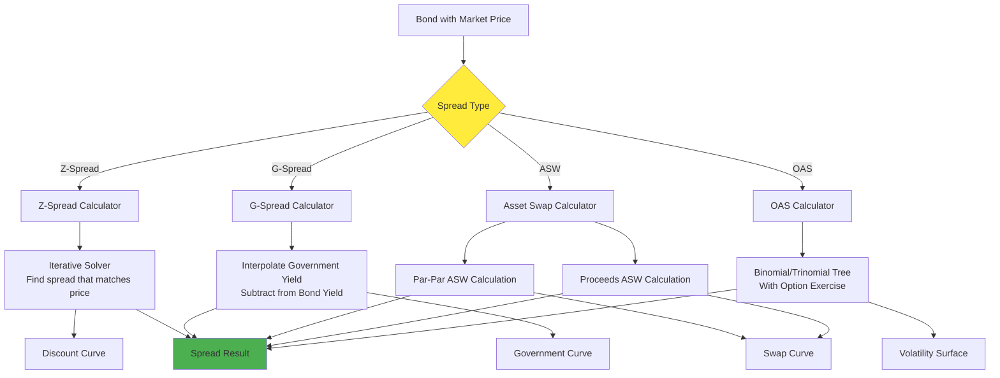

### 5. Risk Calculation Pipeline

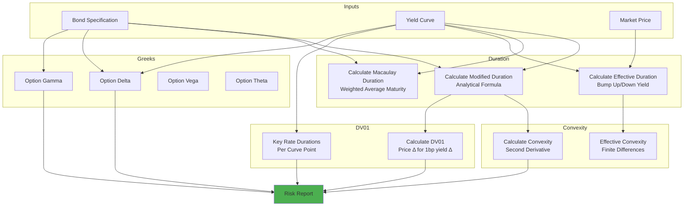

## Data Flow Architecture

### Pricing Data Flow

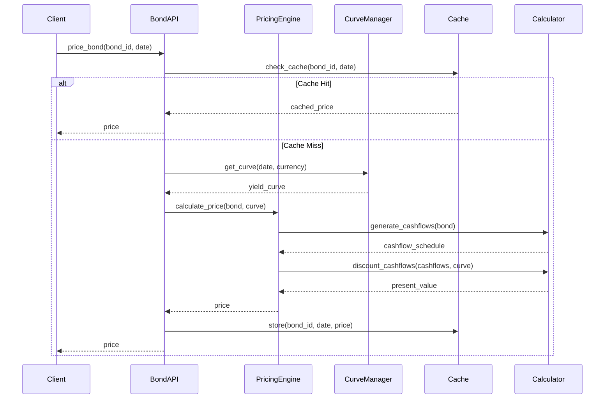

## Module Dependency Graph

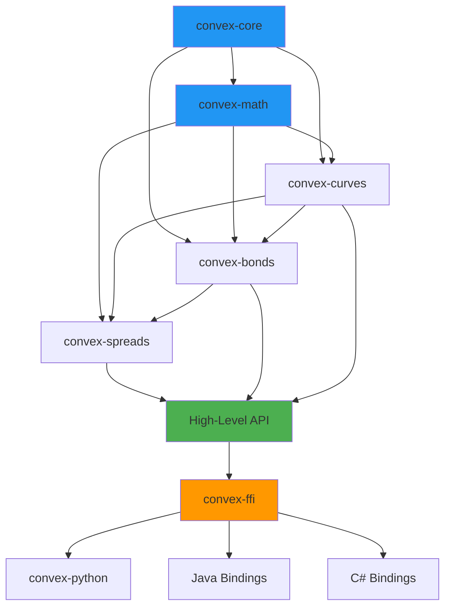

## Performance Optimization Strategy

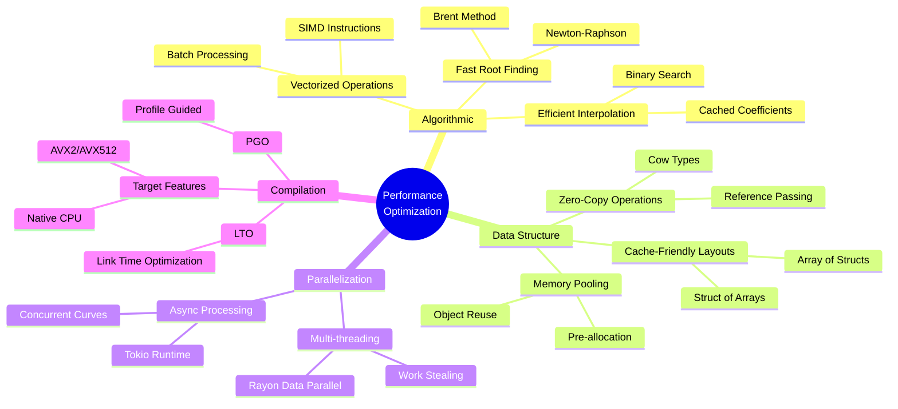

## Testing Strategy

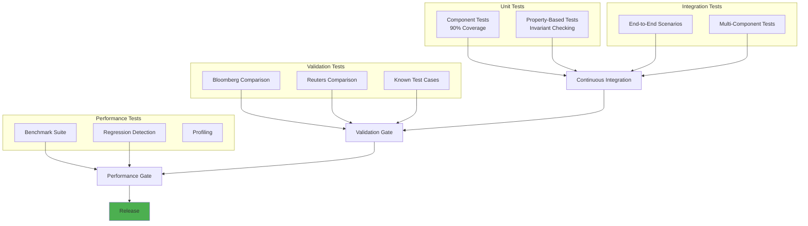

## Deployment Architecture

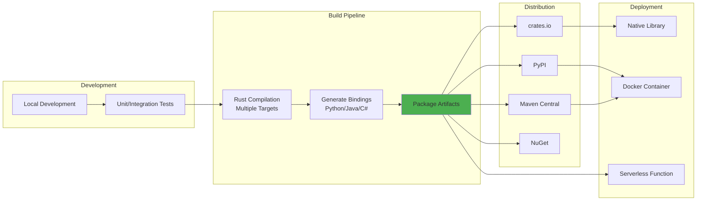

## Security & Safety Architecture

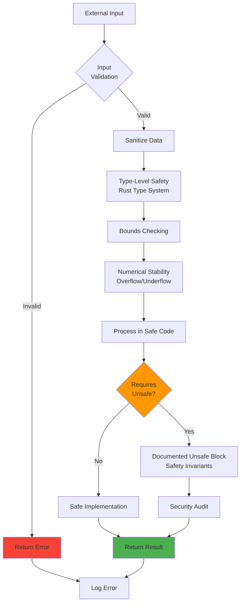
